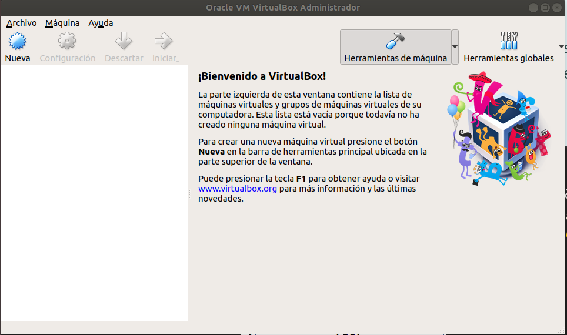

# Tema 1

**Ejercicio 1:**

Consultar en el catálogo de alguna tienda de informática el precio de un ordenador tipo servidor y calcular su coste de amortización a cuatro y siete años. Consultar este artículo en Infoautónomos sobre el tema.

Vamos a elegir TS-1277-64G NAS 12 Bahías – AMD Ryzen 7 1700 64GB de RAM con un coste de 4.112,92€

[Enlace a TS-1277-64G](https://qloudea.com/qnap-ts-1277-1700-64g)

El coste de amortización para equipos para tratamiento de la información es del 25% con un mínimo de cuatro años y un máximo de 8.
Vamos a aplicar una amortización lineal donde las cuotas son constantes y no afecta la depreciación efectiva del inmoviliario. De esta forma:

Activo 4.112,92€ - 21% IVA = 3.249,20€

Para 4 años se amortiza el 25% anual  3.249,20 / 4 = 812,30 €

Para 8 años se amortiza el 14,28% anual  3.249,20 / 7 = 464,17 €

**Ejercicio 2:**

Usando las tablas de precios de servicios de alojamiento de Internet “clásicos”, es decir, que ofrezcan Virtual Private Servers o servidores físicos, y de proveedores de servicios en la nube, comparar el coste durante un año de un ordenador con un procesador estándar (escogerlo de forma que sea el mismo tipo de procesador en los dos vendedores) y con el resto de las características similares (tamaño de disco duro equivalente a transferencia de disco duro) en el caso de que la infraestructura comprada se usa solo el 1% o el 10% del tiempo.

Vamos a comparar lo mejor que nos ofrece cada página.

[Enlace a Servicios en la nube](https://www.acens.com/cloud/cloud-servers/?gclid=EAIaIQobChMIxvD-4-C93QIVAud3Ch0a-AN_EAAYAyAAEgIJBPD_BwE)

Precio 249,90€/mes

Procesador Intel Xeon 12vCPU

RAM de 32 GB

Disco SSD de 360GB

Transferencia ilimitada

Contabiliza los minutos y es redimensionable cuando se necesite.

Si se usa el 10 %  249,90 * 0,10 = 24.99 al mes.

Si se usa el 1%  2.499 al mes.

[enlace al servidor físico](https://www.profesionalhosting.com/servidores-dedicados/servidor-oro-64g-2tb.html#precio)

Precio 450€/mes

Procesador Intel Xeon E5-1650v4

Disco duro 2*2TB

Dominios ilimitados

**Ejercicio 3**

En general, cualquier ordenador con menos de 5 o 6 años tendrá estos flags. ¿Qué modelo de procesador es? ¿Qué aparece como salida de esa orden? Si usas una máquina virtual, ¿Qué resultado da? ¿Y en una Raspberry Pi o, si tienes acceso, el procesador del móvil?

mati@mati-Lenovo-Z50-70:~$ egrep '^flags.\*(vmx|svm)' /proc/cpuinfo

Procesador model name	: Intel(R) Core(TM) i7-4510U CPU @ 2.00GHz

flags		: fpu vme de pse tsc msr pae mce cx8 apic sep mtrr pge mca cmov pat pse36 clflush dts acpi mmx fxsr sse sse2 ss ht tm pbe syscall nx pdpe1gb rdtscp lm constant_tsc arch_perfmon pebs bts rep_good nopl xtopology nonstop_tsc cpuid aperfmperf pni pclmulqdq dtes64 monitor ds_cpl vmx est tm2 ssse3 sdbg fma cx16 xtpr pdcm pcid sse4_1 sse4_2 movbe popcnt tsc_deadline_timer aes xsave avx f16c rdrand lahf_lm abm cpuid_fault epb invpcid_single pti ssbd ibrs ibpb stibp tpr_shadow vnmi flexpriority ept vpid fsgsbase tsc_adjust bmi1 avx2 smep bmi2 erms invpcid xsaveopt dtherm ida arat pln pts flush_l1d

Al usar la maquina virtual, con la orden anterior no obtengo ningún resultado, pero si puedo ver algo parecido con “mati@mati:~$ cat /proc/cpuinfo”

flags		: fpu vme de pse tsc msr pae mce cx8 apic sep mtrr pge mca cmov pat pse36 clflush mmx fxsr sse sse2 syscall nx rdtscp lm constant_tsc rep_good nopl xtopology nonstop_tsc cpuid pni pclmulqdq monitor ssse3 cx16 pcid sse4_1 sse4_2 x2apic movbe popcnt aes xsave avx rdrand hypervisor lahf_lm abm invpcid_single pti fsgsbase avx2 invpcid

He conectado un telefono movil samsum GT a nuestro ubuntu, con el boton derecho tenemos un atajo y abrimos en terminal, ponemos la misma orden y nos aparece lo mismo.

**Ejercicio 4.**

1.Comprobar si el núcleo instalado en tu ordenador contiene este módulo del kernel usando la orden kvm-ok.

He tenido que instalar cpu-checker, orden “sudo apt install cpu-checker”

El resultado de la orden kvm-ok es el siguiente:

mati@mati-Lenovo-Z50-70:~$ kvm-ok

INFO: /dev/kvm exists

KVM acceleration can be used

2.Instalar un hipervisor para gestionar máquinas virtuales, que más adelante se podrá usar en pruebas y ejercicios.

El hipervisor será VirtualBox, Versión 5.2.18 r124319 (Qt5.9.5).

**Ejercicio 5.**

Darse de alta en servicios de nube usando ofertas gratuitas o cupones que pueda proporcionar el profesor.

Me doy de alta en amazon web services que ojeando tiene 12 meses gratis aunque algunos servicios limitados como:
750 horas de cómputo en la nube, lo mismo de servicio de bases de datos para MySQL, PostgreSQL, MariaDB, Oracle BYOL o SQL Server

1GB de análisis empresarial

5GB en infraestructura de almacenaciento

1 millón de solicitudes gratuitas al mes con AWS Lambda

He tenido un problema, no admite mi tarjeta de credito.

Como no logro resolver los problemas con amazon me doy de alta en azure, pero a la hora de solicitar una cuenta gratuita me pide igualmente la tarjeta de credito, asi que aunque tengo cuenta en azure no puedo usarla.  Doy el objetivo por cumplido.

**Ejercicio 6.**

Darse de alta en una web que permita hacer pruebas con alguno de los sistemas de gestión de nube anteriores.

Hemos elegido openstack por ser libre

