# Tema 2

**Ejercicio 1:**

Descargar y ejecutar las pruebas de alguno de los proyectos anteriores, y si sale todo bien, hacer un pull request a este proyecto con tests adicionales, si es que faltan (en el momento que se lea este tema).

Hemos clonado https://github.com/JJ/HitosIV, hemos descargado golang y hemos pasado el test.

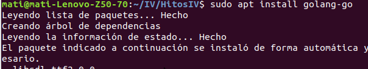

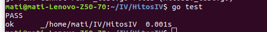

No da ningún error, no vemos que falte ningún test.

**Ejercicio 2:**

Para la aplicación que se está haciendo, escribir una serie de aserciones y probar que efectivamente no fallan. Añadir tests para una nueva funcionalidad, probar que falla y escribir el código para que no lo haga (vamos, lo que viene siendo TDD).

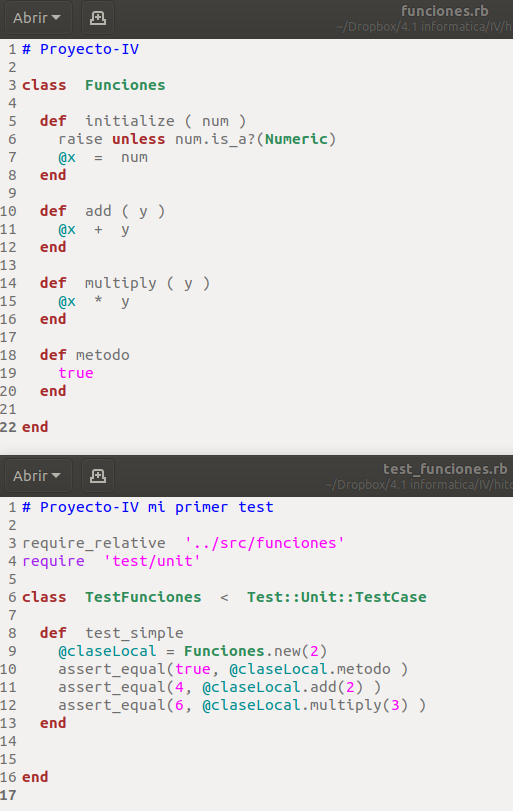

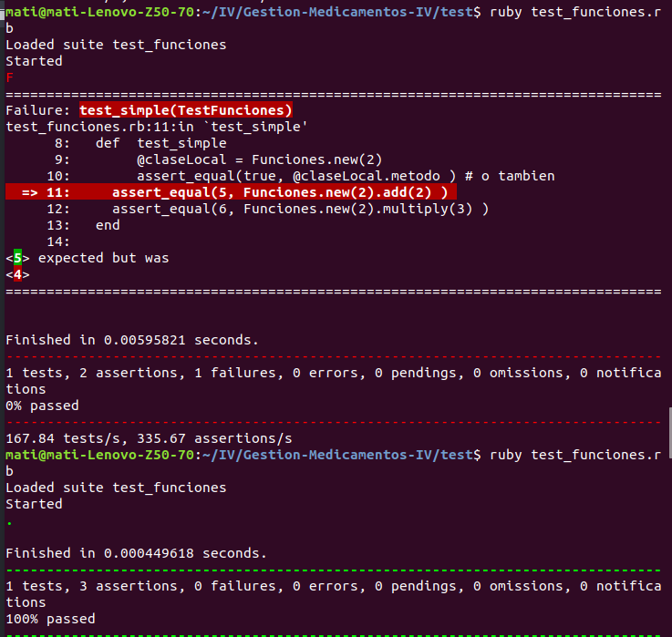

**Ejercicio 3**

Convertir los tests unitarios anteriores con assert a programas de test y ejecutarlos desde mocha, usando descripciones del test y del grupo de test de forma correcta. Si hasta ahora no has subido el código que has venido realizando a GitHub, es el momento de hacerlo, porque lo vas a necesitar un poco más adelante.

Hemos intentado hacer este ejercicio con [rspec para ruby](https://github.com/rspec/rspec), es el similar a mocha para ruby. Lo probamos con el mismo código del ejercicio anterior.

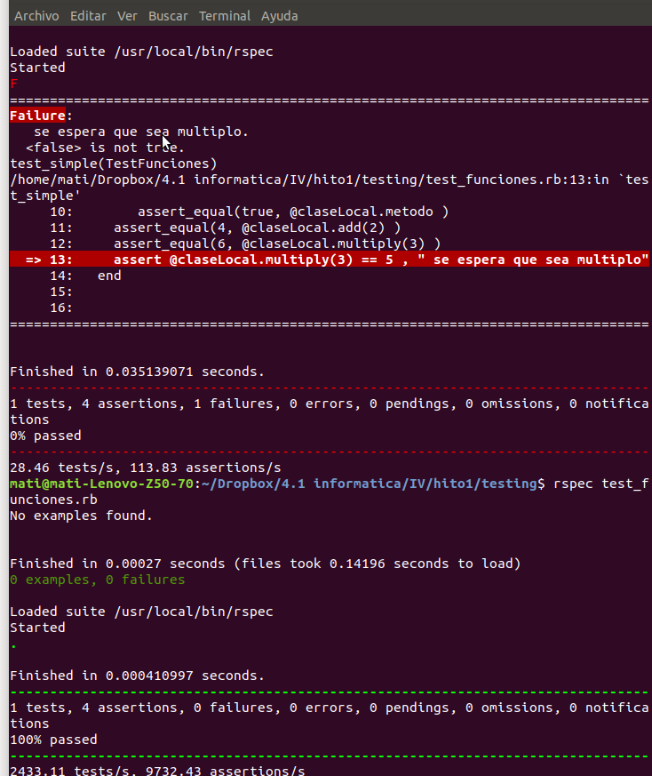

Tambien hemos usado [pocha](https://github.com/rlgomes/pocha), es el marco de mocha para python.

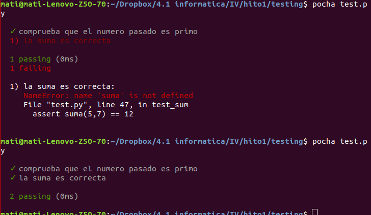

Subimos el código a nuestro proyecto.

**Ejercicio 4.**

Instalar alguno de los entornos virtuales de node.js (o de cualquier otro lenguaje con el que se esté familiarizado) y, con ellos, instalar la última versión existente, la versión minor más actual de la 4.x y lo mismo para la 0.11 o alguna impar (de desarrollo).

Vamos a instalar el entorno virtual para ruby "RVM", para ello seguimos los [siguientes pasos](https://github.com/rvm/ubuntu_rvm):

mati@mati:~$ sudo apt-get install software-properties-common

mati@mati:~$ sudo apt-add-repository -y ppa:rael-gc/rvm

mati@mati:~$ sudo apt-get update

mati@mati:~$ sudo apt-get install rvm

En la ventana de la terminal, Editar -> Preferencias:

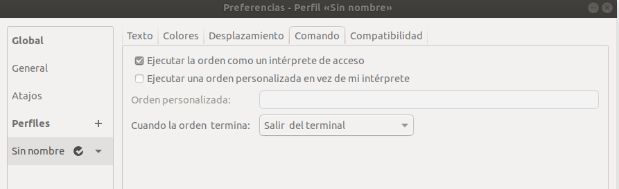

mati@mati:~$ rvm install ruby

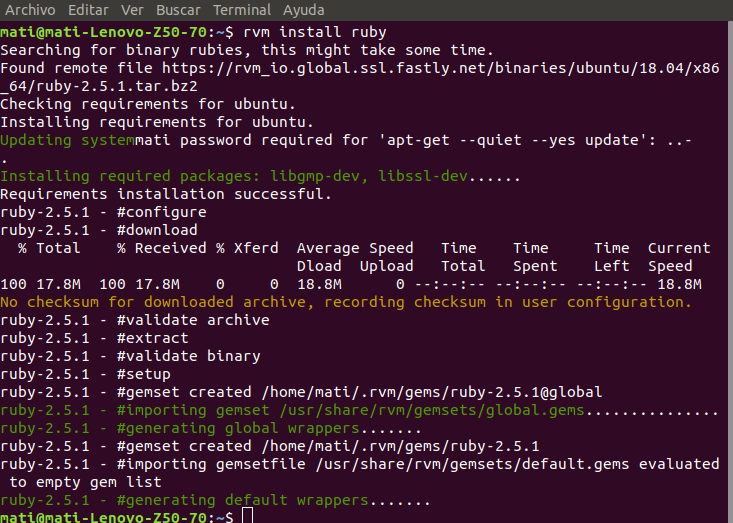

**Ejercicio 5.**

Como ejercicio, algo ligeramente diferente: una web para calificar las empresas en las que hacen prácticas los alumnos.

Las acciones serían

* Crear empresa
* Listar calificaciones para cada empresa
* crear calificación y añadirla (comprobando que la persona no la haya añadido ya)
* borrar calificación (si se arrepiente o te denuncia la empresa o algo)
* Hacer un ránking de empresas por calificación, por ejemplo.
* Crear un repositorio en GitHub para la librería y crear un pequeño programa que use algunas de sus funcionalidades.

Si se quiere hacer con cualquier otra aplicación, también es válido.

Se trata de hacer una aplicación simple que se pueda hacer rápidamente con un generador de aplicaciones como los que incluyen diferentes marcos MVC. Si cuesta mucho trabajo, simplemente prepara una aplicación que puedas usar más adelante en el resto de los ejercicios.

**Ejercicio 6.**

Ejecutar el programa en diferentes versiones del lenguaje. ¿Funciona en todas ellas?

Tenemos instalados las siguientes versiones de ruby con RVM

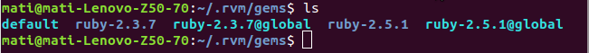

La versión 2.5.1 es la más actual.

Cambiamos de versión para comprobar si funciona.

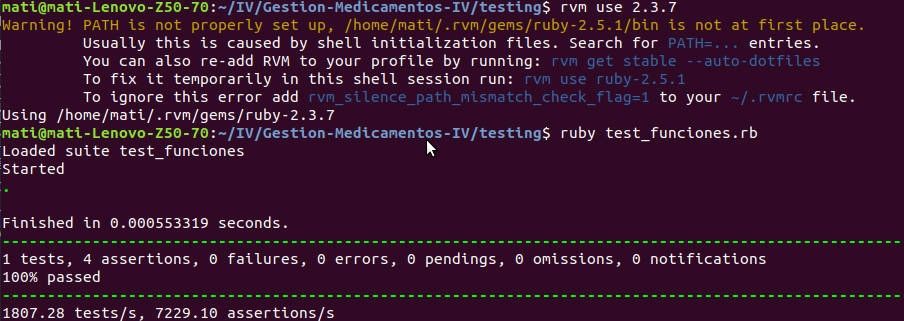

Dejamos en uso la última versión. Las dos funcionan correctamente.

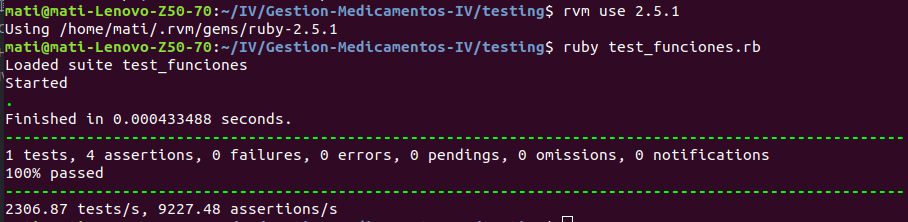

**Ejercicio 7.**

Crear una descripción del módulo usando package.json. En caso de que se trate de otro lenguaje, usar el método correspondiente.

bundle, se encarga de revisar un fichero llamado Gemfile donde se ponen las dependencias necesarias para este proyecto, en nuestro caso ponemos gemspec, sería rspec para los test unitarios.

Lo incluimos a nuestro proyecto.

**Ejercicio 8.**

Automatizar con grunt, gulp u otra herramienta de gestión de tareas en Node la generación de documentación de la librería que se cree usando docco u otro sistema similar de generación de documentación. Previamente, por supuesto, habrá que documentar tal librería.

rake , un programa que puede ejecutar scripts de automatización para ruby.

gem install rake

Ejecutar el comando "rake" sin ninguna opción hará que ejecute la tarea "predeterminada" en el Rakefile.

Lo incluimos a nuestro proyecto y lo comprobamos, funciona correctamente.

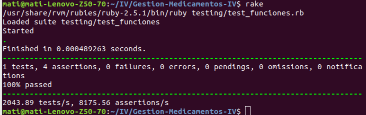

**Ejercicio 9.**

Haced los dos primeros pasos antes de pasar al tercero.
