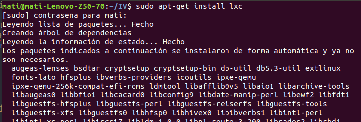
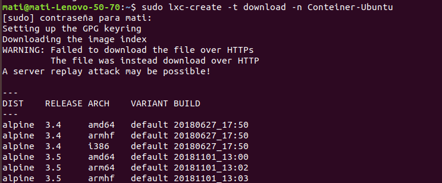

## Tema 4

**Ejercicio 1:**

Instala LXC en tu versión de Linux favorita. Normalmente la versión en desarrollo, disponible tanto en GitHub como en el sitio web está bastante más avanzada; para evitar problemas sobre todo con las herramientas que vamos a ver más adelante, conviene que te instales la última versión y si es posible una igual o mayor a la 1.0.

Para la instalación de lxc hemos seguido el siguiente [tutorial](https://manuelfrancoblog.wordpress.com/2017/09/18/lxc-primeros-pasos/)

Hemos tenido que instalar los siguiente paquetes:

		Sudo apt install lxc -y
		Sudo apt-get install openssl-server

Una vez instalado comprobamos que todo está bien configurado, sale todo enable en verde, por lo tanto todo ok.

**Ejercicio 2:**

Crear y ejecutar un contenedor basado en tu distribución y otro basado en otra distribución, tal como Fedora. Nota En general, crear un contenedor basado en tu distribución y otro basado en otra que no sea la tuya.

Creamos un contenedor ubuntu :

Creamos otro contenedor gentoo y le damos el nombre de centos.

Listamos los contenedores

Arrancamos ubuntu y mostramos la información del contenedor:

**Ejercicio 3**

Instalar docker.

