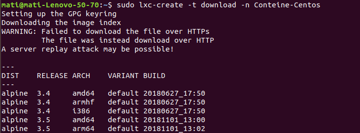

## Tema 4

**Ejercicio 1:**

**Instala LXC en tu versión de Linux favorita. Normalmente la versión en desarrollo, disponible tanto en GitHub como en el sitio web está bastante más avanzada; para evitar problemas sobre todo con las herramientas que vamos a ver más adelante, conviene que te instales la última versión y si es posible una igual o mayor a la 1.0.**

Para la instalación de lxc hemos seguido el siguiente [tutorial](https://manuelfrancoblog.wordpress.com/2017/09/18/lxc-primeros-pasos/)

Hemos tenido que instalar los siguiente paquetes:

		Sudo apt install lxc -y
		Sudo apt-get install openssl-server

Una vez instalado comprobamos que todo está bien configurado, sale todo enable en verde, por lo tanto todo ok.

**Ejercicio 2:**

**Crear y ejecutar un contenedor basado en tu distribución y otro basado en otra distribución, tal como Fedora. Nota En general, crear un contenedor basado en tu distribución y otro basado en otra que no sea la tuya.**

Creamos un contenedor ubuntu :

....

Creamos otro contenedor gentoo y le damos el nombre de centos.

.....

Listamos los contenedores

Arrancamos ubuntu y mostramos la información del contenedor:

**Ejercicio 3**

**Instalar docker.**

Seguimos la guía de [docker](https://docs.docker.com/install/linux/docker-ce/ubuntu/). O la guía del blog de [ubuntu](https://ubunlog.com/como-instalar-docker-en-ubuntu-18-04-y-derivados/)

Primero limpiamos de distribuciones antiguas de docker

añadimos la clave gpg, verificamos la huella digital, por ultimo añadimos el repositorio al sistema:

Actualizamos el sistema.

Instalamos con "sudo apt-get install docker-ce" y reiniciamos

Verificamos que se ha instalado con éxito y que está activo:

**Ejercicio 4.**

**Instalar a partir de docker una imagen alternativa de Ubuntu y alguna adicional, por ejemplo de CentOS. Buscar e instalar una imagen que incluya MongoDB.**

**Ejercicio 5.**

**Crear un usuario propio e instalar alguna aplicación tal como nginx en el contenedor creado de esta forma, usando las órdenes propias del sistema operativo con el que se haya inicializado el contenedor.**

**Ejercicio 6.**

**Crear a partir del contenedor anterior una imagen persistente con commit.**

**Ejercicio 7.**

**Crear un Dockerfile para el servicio web que se ha venido desarrollando en el proyecto de la asignatura.**

En mi caso creamos un [Dockerfile para ruby](https://docs.docker.com/samples/library/ruby/#create-a-dockerfile-in-your-ruby-app-project)

			FROM ruby:2.5
			MAINTAINER Matilde Cabrera <mati331@correo.ugr.es>

			# lanzar errores si Gemfile ha sido modificado desde Gemfile.lock
			RUN bundle config --global frozen 1

			COPY Gemfile Gemfile.lock ./
			RUN bundle install

			COPY . .

			# Comando predeterminado, ejecutando la aplicación como un servicio
			CMD ["bundle", "rackup", "config.ru", "-p", "80", "-s","--host", "0.0.0.0"]

**Ejercicio 8.**

**Desplegar un contenedor en alguno de estos servicios, de prueba gratuita o gratuitos.**

Explicamos el despliegue en la documentación de [docker](https://github.com/mati3/Gestion-Medicamentos-IV/blob/master/doc/docker.md)
