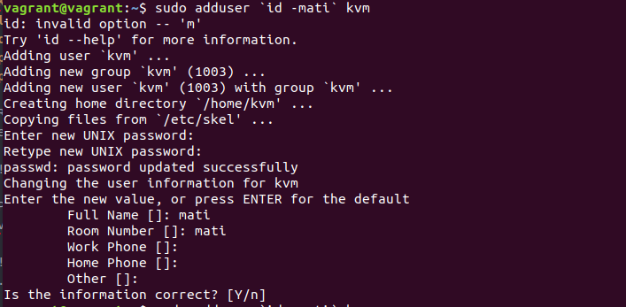
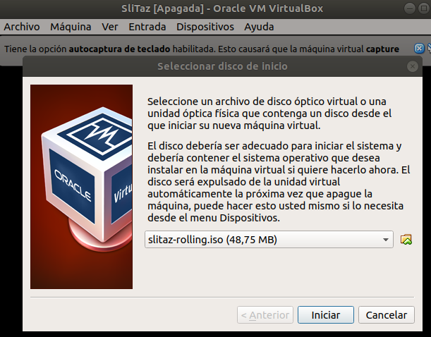
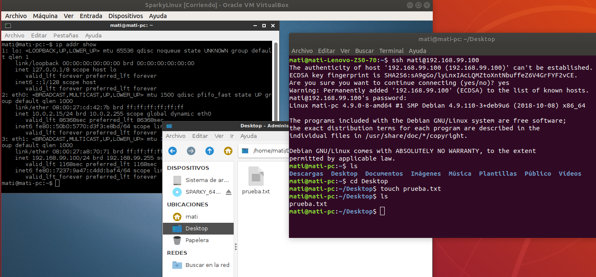

## Tema 5

**Ejercicio 1:**

**Instalar los paquetes necesarios para usar KVM. Se pueden seguir estas instrucciones. Ya lo hicimos en el primer tema, pero volver a comprobar si nuestro sistema está preparado para ejecutarlo o hay que conformarse con la paravirtualización.**

Refrescamos la información de los primeros ejercicios.

Vemos si nuestro procesador es de 64 bits y si el kernel ejecuta en 64 bits.

Nuestro pc no está preparado para la virtualización de hardware, tenemos que conformarnos con la paravirtualización.

Por seguridad intento seguir en una maquina virtual vagrant [siguiendo el enlace del mismo ejercicio](https://wiki.debian.org/KVM#Installation). Instalo KVM:

...

...

Agregamos nuestro nombre de usuario a libvirtd y a grupo.

Después de la instalación no me deja ejecutar nada.

**Ejercicio 2:**

**2.1 Crear varias máquinas virtuales con algún sistema operativo libre tal como Linux o BSD. Si se quieren distribuciones que ocupen poco espacio con el objetivo principalmente de hacer pruebas se puede usar CoreOS (que sirve como soporte para Docker) GALPon Minino, hecha en Galicia para el mundo, Damn Small Linux, SliTaz (que cabe en 35 megas) y ttylinux (basado en línea de órdenes solo).**

**2.2 Hacer un ejercicio equivalente usando otro hipervisor como Xen, VirtualBox o Parallels.**

Me descargo varias Isos. Ninguno coincide el hash.  Me decanto por Slitaz. Este si es el mismo.

Vamos a usar VirtualBox que ya tenemos instalado:

**Ejercicio 3**

**Crear un benchmark de velocidad de entrada salida y comprobar la diferencia entre usar paravirtualización y arrancar la máquina virtual simplemente con:**

**qemu-system-x86_64 -hda /media/Backup/Isos/discovirtual.img**

**Ejercicio 4.**

**Crear una máquina virtual Linux con 512 megas de RAM y entorno gráfico LXDE a la que se pueda acceder mediante VNC y ssh.**

Descargo lubuntu-18.10-desktop-amd64.iso, compruebo su hash y coincide.

Al igual que en el ejercicio 2.2 lo instalo usando VirtualBox. Instalación por defecto. Al instalarlo la maquina virtual ya no me es accesible por interfaz, mensaje:

      Result Code: NS_ERROR_FAILURE
      (0x80004005) Componente: VirtualBoxWrap
      Interfaz: IVirtualBox {} Receptor:
      IVirtualBoxClient

Arreglo, eliminando la maquina virtual instalada desde terminal y con lo siguiente:

Se pueden ver las distribuciones ligeras [aquí](https://www.linuxadictos.com/distribuciones-ligeras.html).

Probamos con lubuntu-18.10-desktop-i386.iso de la misma forma. Nuestra cpu no está preparada.

Ultima prueba con [SparkyLinux](https://sparkylinux.org/download/stable/). Procedemos de la misma forma, descarga, compruebo el hash, insatalación por defecto con VirtualBox.

Apagamos la maquina y la preparamos. Incluimos un segundo adaptador de red.

Volvemos a iniciar la maquina. Instalamos ssh:

Conectamos con ssh y comprobamos que aparece un archivo que creamos desde nuestra maquina anfitrión:

**Ejercicio 5.**

**Crear una máquina virtual ubuntu e instalar en ella alguno de los servicios que estamos usando en el proyecto de la asignatura.**

Enlace a la documentación del proyecto donde está englobado.

**Ejercicio 6.**

**Instalar una máquina virtual con Linux Mint para el hipervisor que tengas instalado.**

Buscamos Linux Mint y descargamos la penultima versión para asegurarnos que sea estable. Procedemos como en ejercicios anteriores, descarga, comprobamos hash. Instalacion en VirtualBox por defecto:

