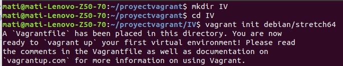
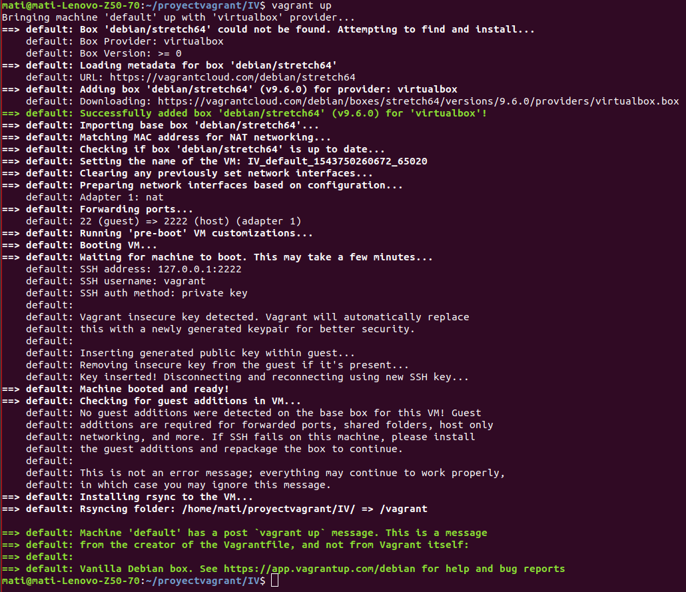
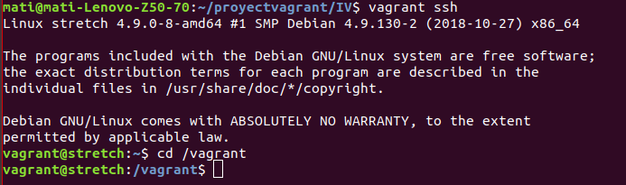
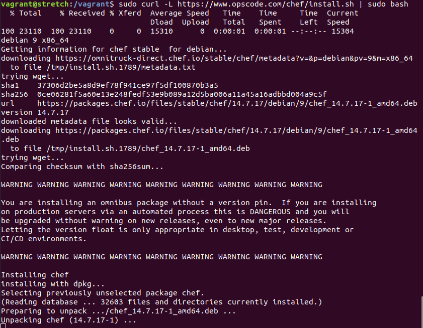
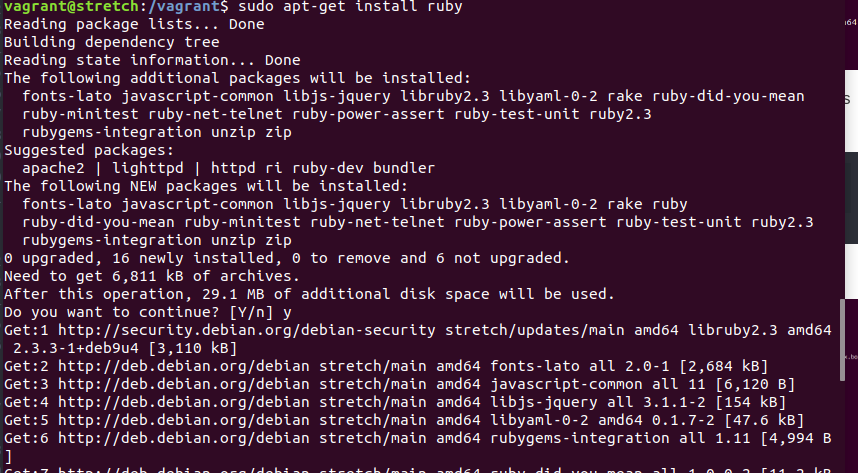
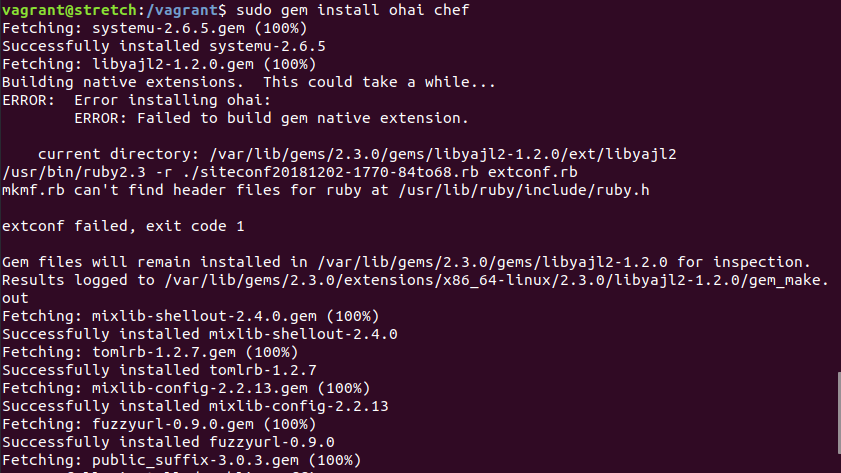
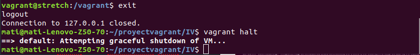

## Tema 6

**Ejercicio 1:**

**Desplegar la aplicación de DAI con todos los módulos necesarios usando un playbook de Ansible.**

**Ejercicio 2:**

**Instalar una máquina virtual Debian usando Vagrant y conectar con ella.**

Preparamos el entorno:

Ultima orden crea un archivo Vagrantfile, del cual nos interesa lo siguiente:

    Vagrant.configure("2") do |config|
      config.vm.box = "debian/stretch64"
    end

Instalamos la maquina y conectamos con ella:

**Ejercicio 3**

**Crear un script para provisionar nginx o cualquier otro servidor web que pueda ser útil para alguna otra práctica.**

      Vagrant.configure("2") do |config|

        config.vm.box = "bento/ubuntu-18.04"
        config.vm.network "forwarded_port", guest: 5000, host: 8080, host_ip: "0.0.0.0"
        config.vm.provision "shell", inline: <<-SHELL
            apt-get update
            apt-get install nginx
      end  

**Ejercicio 4.**

**Configurar tu máquina virtual usando vagrant con el provisionador ​chef.​**

Usamos la maquina del ejercicio 2. Ejecutaremos la versión aislada chef-solo desde dentro de nuestra maquina virtual. Lo hacemos de las dos formas que se indican en los apuntes.

Primero instalamos curl, y ejecutamos "curl -L https://www.opscode.com/chef/install.sh | bash"

Instalamos ruby. Después instalamos la gema "gem install ohai chef"

Para salir "exit"

Para terminar hay que dejar la maquina apagada: "vagrant halt"

