## Tema 3

**Ejercicio 1:**

Darse de alta en algún servicio PaaS tal como Heroku, zeit, BlueMix u OpenShift.

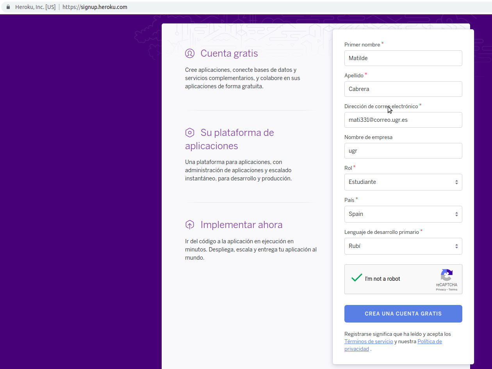

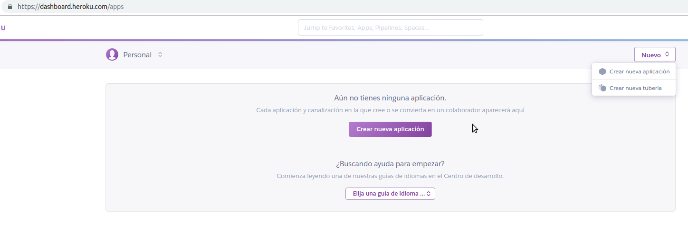

**Ejercicio 2:**

Crear una aplicación en OpenShift o en algún otro PaaS en el que se haya dado uno de alta. Realizar un despliegue de prueba usando alguno de los ejemplos incluidos con el PaaS.

* Seguimos los pasos que nos indica la documentación en la propia pagina de [heroku](https:https://www.heroku.com/)

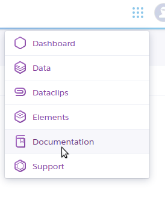

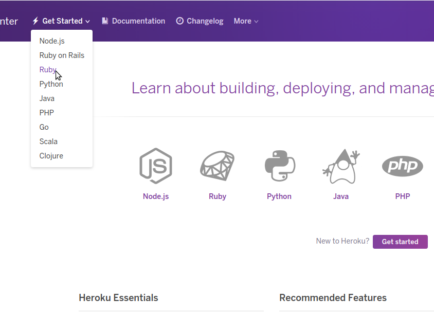

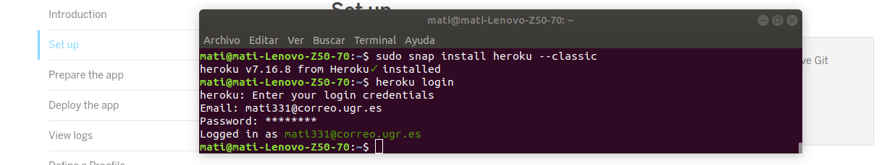

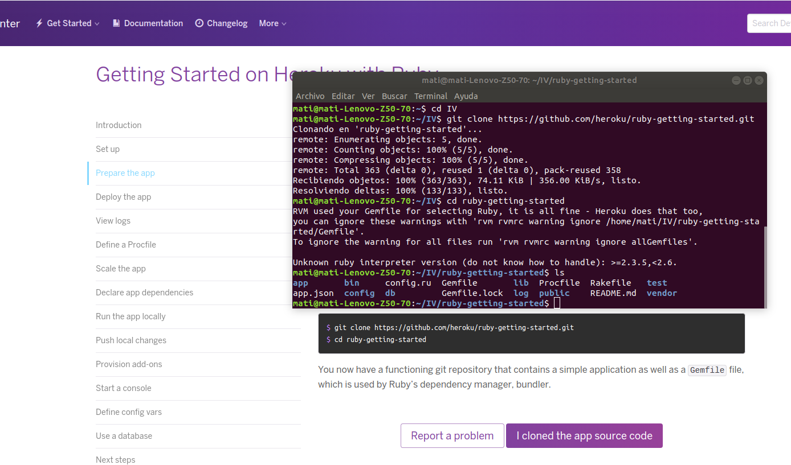

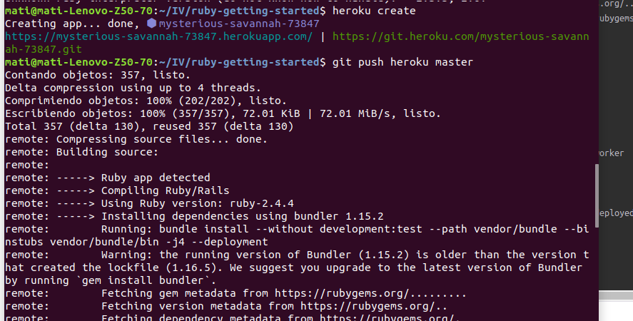

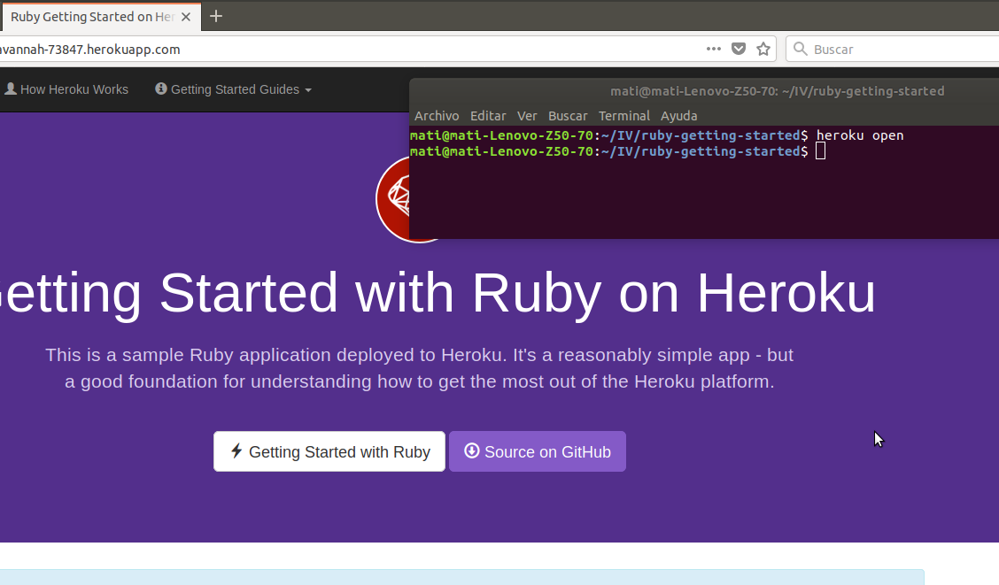

**Ejercicio 3**

Realizar una app en express (o el lenguaje y marco elegido) que incluya variables como en el caso anterior.

Realizo una app en sinatra, el lenguaje elegido para nuestro proyecto.

** Instalo de la siguiente manera**

	* gem install sinatra

** Probar sinatra **

	$ ruby miapp.rb

** Despues de ejecutarlo ir al navegador **

	localhost:8181

** Para mas información pagina oficial de [sinatra](http://sinatrarb.com/intro-es.html) o [la guía de sinatra en git](https://github.com/sinatra/sinatra). **

** Nuestra primera aplicación tiene solo un archivo que incluiremos en la carpeta llamada sinatra, en el repositorio del proyecto. Es un simple hola mundo para ver que todo funciona. **

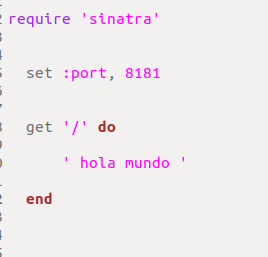

** Prueba de funcionamiento: **

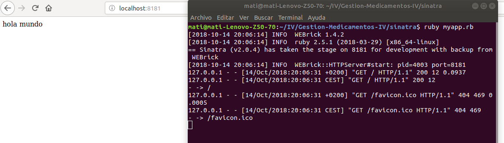

**Ejercicio 4.**

Crear pruebas para las diferentes rutas de la aplicación.

**Ejercicio 5.**

Instalar y echar a andar tu primera aplicación en Heroku.mplemente prepara una aplicación que puedas usar más adelante en el resto de los ejercicios.

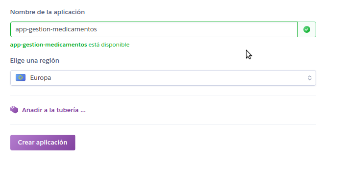

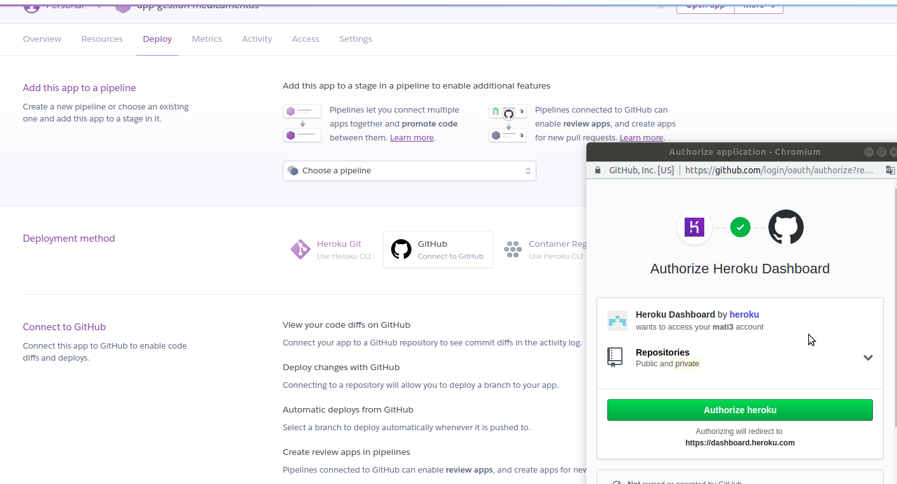

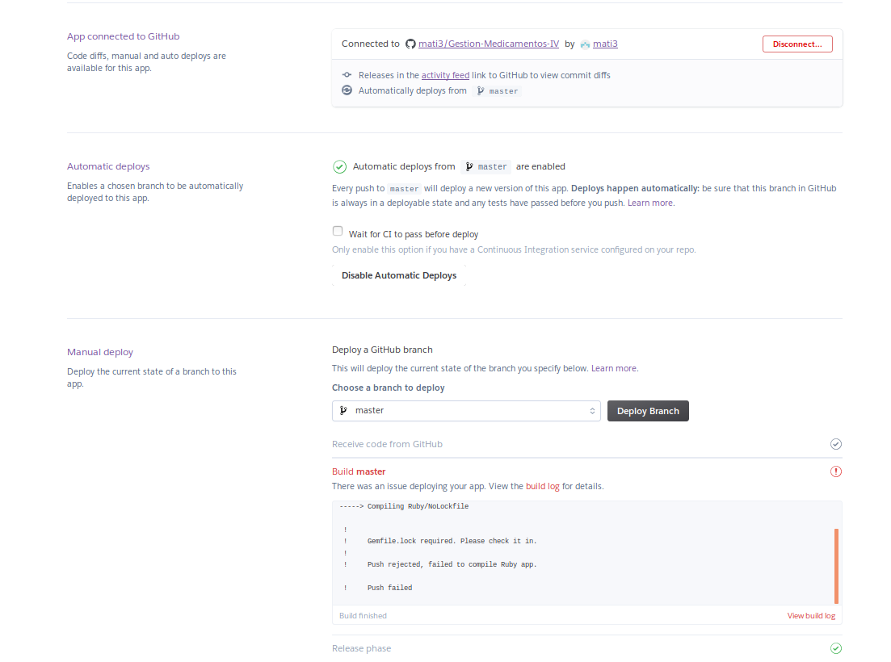

Podemos ver que requiere el archivo gemfile.lock, para generar dicho archivo desde linea de comando ejecutamos bundle install, lo agregamos a nuestro proyecto.

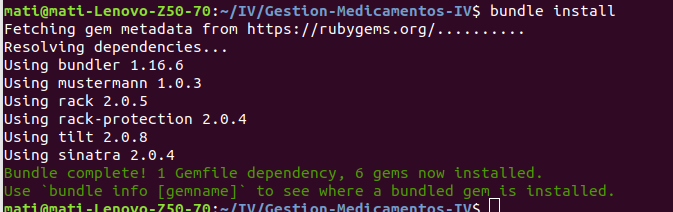

Ya tenemos la respuesta esperada:

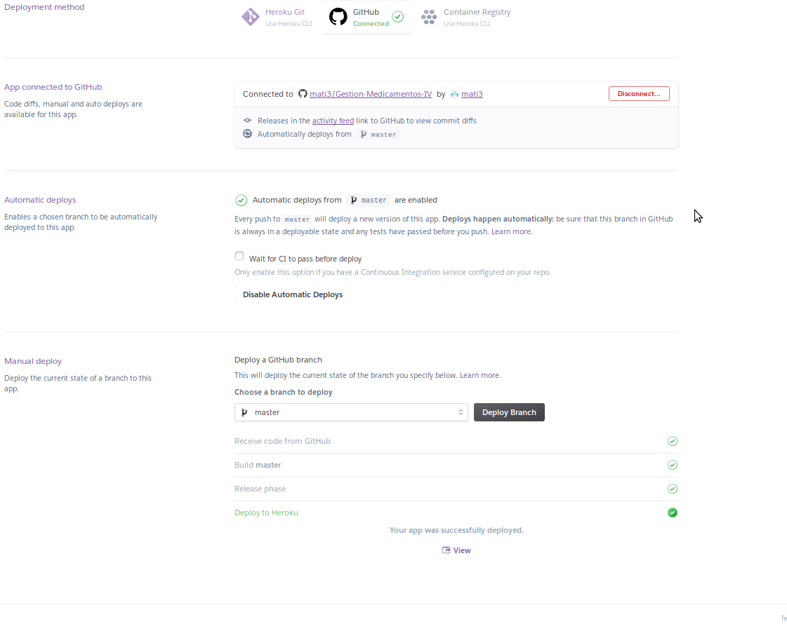

**Ejercicio 6.**

Usar como base la aplicación de ejemplo de heroku y combinarla con la aplicación en node que se ha creado anteriormente. Probarla de forma local con foreman. Al final de cada modificación, los tests tendrán que funcionar correctamente; cuando se pasen los tests, se puede volver a desplegar en heroku.

Como en todos los ejemplos anteriores, se puede cambiar “node” y “heroku” por la herramienta que se haya elegido.

 Hemos incluido sinatra con heroku, podemos verlo en el repositorio del proyecto y en la documentación del ejercicio anterior. Enlace a doc de [heroku](https://github.com/mati3/Gestion-Medicamentos-IV/tree/master/doc/heroku.md)

**Ejercicio 7.**

Haz alguna modificación a tu aplicación en node.js para Heroku, sin olvidar añadir los tests para la nueva funcionalidad, y configura el despliegue automático a Heroku usando Snap CI o alguno de los otros servicios, como Codeship, mencionados en StackOverflow

El despliegue en Heroku se hace de forma automática como se puede ver en la documentación  de nuestro proyecto.

**Ejercicio 8.**

Preparar la aplicación con la que se ha venido trabajando hasta este momento para ejecutarse en un PaaS, el que se haya elegido.

Aunque hemos hecho los ejercicios en heroku, vamos a preparar nuestra aplicación para hacer el despliegue en azure.
